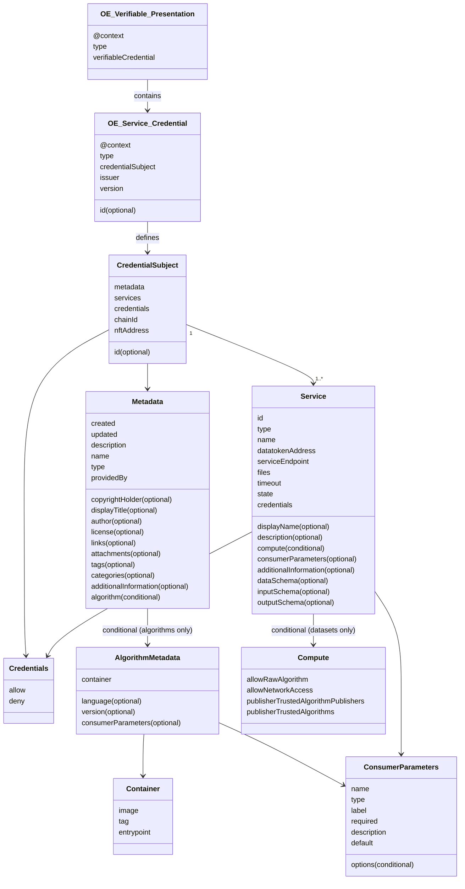

# Complete Overview (Schema)

:::details[mermaid]

```mermaid
classDiagram
    class OE_Verifiable_Presentation {
        @context
        type
        verifiableCredential
    }
    class OE_Service_Credential {
        @context
        id (optional)
        type
        credentialSubject
        issuer
        version
    }
    class CredentialSubject {
        id (optional)
        metadata
        services
        credentials
        chainId
        nftAddress
    }
    class Metadata {
        created
        updated
        description
        copyrightHolder (optional)
        name
        displayTitle (optional)
        type
        author (optional)
        providedBy
        license (optional)
        links (optional)
        attachments (optional)
        tags (optional)
        categories (optional)
        additionalInformation (optional)
        algorithm (conditional)
    }
    class Credentials {
        allow
        deny
    }
    class Service {
        id
        type
        name
        displayName (optional)
        description (optional)
        datatokenAddress
        serviceEndpoint
        files
        timeout
        compute (conditional)
        consumerParameters (optional)
        additionalInformation (optional)
        state
        credentials
        dataSchema (optional)
        inputSchema (optional)
        outputSchema (optional)
    }
    class AlgorithmMetadata {
        container
        language (optional)
        version (optional)
        consumerParameters (optional)
    }
    class Container {
        image
        tag
        entrypoint
    }
    class ConsumerParameters {
        name
        type
        label
        required
        description
        default
        options (conditional)
    }
    class Compute {
        allowRawAlgorithm
        allowNetworkAccess
        publisherTrustedAlgorithmPublishers
        publisherTrustedAlgorithms
    }

    OE_Verifiable_Presentation --> OE_Service_Credential : contains
    OE_Service_Credential --> CredentialSubject : defines

    CredentialSubject --> Metadata
    CredentialSubject --> Credentials
    CredentialSubject "1" --> "1..*" Service

    Metadata --> AlgorithmMetadata : conditional (algorithms only)
    AlgorithmMetadata --> Container
    AlgorithmMetadata --> ConsumerParameters

    Service --> Compute : conditional (datasets only)
    Service --> ConsumerParameters
    Service --> Credentials

```
:::